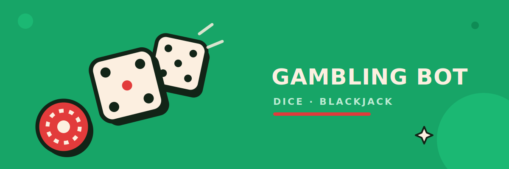

<div align="center">




[](https://discord.gg/P992BnNMbw)

</div>

# Gambler

A Discord economy, casino, and RPG bot built with `discord.py`, featuring ten casino
games, a full virtual economy (bank, shop, trading, marriage, lottery, robbing), a
from-scratch RPG (7 classes, 16 dungeons, level 1-1500 with prestige), and
MySQL-backed persistence.

📊 **~7,830 lines of Python** across 51 files.

## Features

**Casino Games** — Blackjack (with Split), Mines (customizable grid size), Hilo, Plinko,
Limbo, Keno, Slots, Roulette, Dice, Baccarat, Horse Race, Scratchcard, and Solo Coinflip
(`/soloflip`) — all against the house — plus a PvP `/coinflip` duel between two players.
All games are mathematically fair with a fixed, transparent house edge (`HOUSE_EDGE` in
`utils/economy.py`, default 3%); Horse Race and Baccarat derive their odds directly from
simulating the actual game rules (validated against real-world baccarat statistics)
rather than hand-picked numbers. Interactive ones (Blackjack, Mines, Hilo, Keno,
Scratchcard, Horse Race) use Discord's native buttons and select menus — Scratchcard is
click-to-reveal tile by tile, and Horse Race lets you pick your horse from a dropdown
after betting — and several (Blackjack, Slots, Horse Race, Baccarat) play out with a
timed animated reveal instead of showing the result instantly. Blackjack and Hilo render
playing cards with custom Discord emojis (`assets/cards/`, mapped in `utils/cards.py`)
instead of plain text.

**RPG** (`rpg/`, `commands/rpg_*.py`) — a full slash-only RPG sharing the same wallet as
the casino:
- 7 classes (Warrior, Mage, Rogue, Paladin, Necromancer, Ranger, Berserker), each with a
  unique active skill
- 16 dungeons spanning level 1-1500, each with a programmatically-scaled boss fight
- prestige every 50 levels (up to prestige 29) once you hit the level cap
- 3 equipment slots (weapon/armor/accessory) across 6 tiers (common → ancient), plus a
  gold-sink enchant/upgrade system per item
- 3 consumable potions to heal mid-run, persistent HP with passive regen, and `/heal` to
  pay gold for an instant restore (also revives you at 0 HP)
- PvP `/duel` with a cooldown, and an `/arena` leaderboard of top duelists

**Economy** — a per-user virtual balance stored in MySQL, with:
- `daily` bonus, `work`/`crime`/`slut` for risk-based income, and `rob` to steal from others
- a `bank` to protect balance from being robbed
- a `shop` with items (rob shield, cooldown reset), plus `gift` and `trade` between players
- `marry`/`divorce` and a weekly `lottery` with an automatic prize draw
- `profile`/`stats` and multiple `leaderboard` variants (balance, games played, biggest
  win, most successful robberies)
- `cooldowns` to check your remaining cooldowns without triggering them
- admin commands to add, set, give-to-everyone, or reset a user's balance, grant RPG
  levels/items directly, and per-server `settings` to disable individual games or
  restrict them to specific channels

**Commands** — casino/economy commands are hybrid commands (work as both `/slash` and
`!prefix`); the RPG is slash-only for simplicity.

**UI** — built entirely with Discord's Components V2 (`Container`, `TextDisplay`,
`ActionRow`) instead of classic embeds, which requires `discord.py` 2.6 or newer.

**Infrastructure** — a per-channel rate limiter (`utils/ratelimit.py`) to avoid Discord
API throttling on frequent message edits, hot code reloading in development
(`HOT_RELOAD=true`, picks up changes to `commands/`, `events/`, `rpg/`, `utils/`, and
`database/` within ~1.5s with no restart), and optional restart/crash announcements to a
configured Discord channel.

## Setup

1. **Install dependencies**

   ```bash
   python3 -m venv .venv
   source .venv/bin/activate
   pip install -r requirements.txt
   ```

2. **Create a MySQL database**

   ```sql
   CREATE DATABASE gambler CHARACTER SET utf8mb4;
   ```

   All required tables are created automatically on startup.

3. **Configure `.env`**

   Copy `.env.example` to `.env` and fill it in:

   ```bash
   cp .env.example .env
   ```

   | Variable | Description |
   |---|---|
   | `DISCORD_TOKEN` | Bot token from the [Discord Developer Portal](https://discord.com/developers/applications) |
   | `PREFIX` | Prefix for text commands (default: `!`) |
   | `DB_HOST` / `DB_PORT` / `DB_USER` / `DB_PASSWORD` / `DB_NAME` | MySQL credentials |
   | `STARTING_BALANCE` | Starting balance for new players (default: 1000) |
   | `DAILY_AMOUNT` | Amount granted by the daily bonus (default: 500) |
   | `HOT_RELOAD` | Auto-reload changed cogs/modules in development (default: `true`) |
   | `RESTART_LOG_CHANNEL_ID` | Optional channel ID for startup/crash/restart announcements |

   In the Developer Portal, enable the **Message Content Intent** under **Bot** (required
   for text commands), and when inviting the bot, select the `bot` + `applications.commands`
   scopes along with sufficient permissions (Send Messages, Embed Links).

4. **Run the bot**

   ```bash
   python main.py
   ```

   On startup, all cogs in `commands/` and `events/` are loaded automatically and slash
   commands are synced with Discord.

## Deploying to a VPS

MySQL runs in Docker; the bot itself runs natively under [pm2](https://pm2.keymetrics.dev/)
so `git pull` + a pm2 restart is all a routine update needs. MySQL is bound to `127.0.0.1`
only — reachable from the bot process on the same VPS, never from the public internet.

1. Get the code onto the VPS (`git clone` this repo, or `scp` it over), install Docker
   and pm2 (Python deps are handled automatically — see below):

   ```bash
   curl -fsSL https://get.docker.com | sh
   npm install -g pm2
   ```

2. Create `.env` and generate the DB secret files:

   ```bash
   cp .env.example .env
   bash deploy/init_secrets.sh
   ```

   Fill in `DISCORD_TOKEN` in `.env`. The DB password itself is never stored in `.env` —
   `init_secrets.sh` generates `secrets/mysql_root_password.txt` and
   `secrets/db_password.txt` (gitignored), which `docker-compose.yml` reads directly via
   Docker secrets. Point `.env`'s `DB_PASSWORD_FILE` at the same `db_password.txt` path it
   printed, and set `DB_HOST=127.0.0.1`, `DB_USER=gambler_bot`, `DB_PORT=3306` — unless
   the VPS already has its own MySQL/MariaDB bound to port 3306 (`sudo ss -tlnp | grep
   3306` to check), in which case use `DB_PORT=3307` and update the port mapping in
   `docker-compose.yml` to `127.0.0.1:3307:3306` to match. Using the same file on both
   sides means the bot and MySQL can never end up with mismatched credentials.

3. Start MySQL:

   ```bash
   docker compose up -d mysql
   ```

4. Start the bot under pm2:

   ```bash
   bash deploy/install_pm2.sh
   ```

   This starts the bot as pm2 process `GamblerV2` (auto-restart on crash, daily restart at
   4am via `cron_restart`, see `deploy/ecosystem.config.js`), runs `pm2 save`, and posts a
   ✅/❌ status message to `RESTART_LOG_CHANNEL_ID` if it's set in `.env`. Run
   `pm2 startup` once afterward (and follow the printed command) so pm2 itself — and
   everything it manages — comes back up after a VPS reboot.

   On first run, `main.py` bootstraps its own `venv/` and installs `requirements.txt`
   into it automatically before importing anything third-party, then relaunches itself
   inside that venv — no manual `pip install` step needed, and later restarts are a
   no-op since the venv already exists.

Both MySQL (`restart: unless-stopped`) and the bot (pm2 `autorestart`) recover
automatically from a crash; pm2's `cron_restart` additionally restarts the bot process
daily at 4am. Useful commands: `pm2 status`, `pm2 logs GamblerV2`, `pm2 restart GamblerV2`.

## Documentation

An 83-note wiki at [`docs/rpg-wiki/`](docs/rpg-wiki) documents every system in the bot in
detail, generated from the bot's own live game data to stay accurate. Start at
[`Home.md`](docs/rpg-wiki/Home.md) — it's an [Obsidian](https://obsidian.md) vault, so
opening the `docs/rpg-wiki` folder in Obsidian gets you the full interlinked graph view,
but every note is plain Markdown and browsable directly on GitHub too.

| Section | Covers |
|---|---|
| [RPG Overview](docs/rpg-wiki/RPG%20Overview.md) | Classes, dungeons, bosses, equipment tiers, leveling & prestige (level 1-1500) |
| [Casino Games](docs/rpg-wiki/Casino%20Games/Casino%20Overview.md) | All 10 games of chance and their odds |
| [Economy](docs/rpg-wiki/Economy/Economy%20Overview.md) | Balance, daily, bank, hustling (work/crime/slut/rob) |
| [Social](docs/rpg-wiki/Social/Social%20Overview.md) | Marriage, trading, the weekly lottery |
| [Admin & Settings](docs/rpg-wiki/Admin%20%26%20Settings/Admin%20Overview.md) | Server configuration, moderation commands |
| [Infrastructure](docs/rpg-wiki/Infrastructure/Infrastructure%20Overview.md) | Database layer, rate limiting, hot reload, error handling |

## Commands

### Economy
- `balance [user]` — view balance
- `daily` — claim your daily bonus
- `leaderboard [board] [limit]` — leaderboard (`balance`, `games_played`,
  `total_wagered`, `biggest_win`, or `robs_succeeded`)
- `pay <user> <amount>` — transfer balance to another player

### Earning money (on cooldown)
- `work` — risk-free small income (cooldown: 30 min)
- `crime` — high payout possible, but risk of a fine (cooldown: 45 min)
- `slut` — same idea as `crime` with its own odds (cooldown: 45 min)
- `rob <user>` — try to steal balance from another player; pay a fine to the victim on
  failure (cooldown: 60 min, target needs at least 100 🪙, bank balance and an active
  `shield` protect against it)
- `cooldowns` — shows how long until your work/crime/slut/rob are ready again

### Bank
- `bank` — shows cash and bank balance
- `deposit <amount>` — move cash into the bank (number, `half`, or `all`)
- `withdraw <amount>` — move money from the bank back to cash (number, `half`, or `all`)

Money in the bank can't be stolen with `rob`.

### Shop, Inventory & Trading
- `shop` — shows purchasable items
- `buy <item> [quantity=1]` — buy an item (`shield` or `cooldown_reset`)
- `inventory` (alias `inv`) — shows your inventory
- `use <item>` — use an item (`shield` protects you from `rob` for 2h, `cooldown_reset`
  instantly resets work/crime/slut/rob)
- `gift <user> <item> [quantity=1]` — gift an item to another player
- `trade <user> <give> <give_quantity> <want> <want_quantity>` — offer money or an item
  in exchange for money or an item from another player; they must accept

### Social
- `coinflip <user> <amount>` — challenge another player to a coinflip wager; they must
  accept before any balance changes hands
- `marry <user>` / `divorce` / `marriage [user]` — propose marriage, end it, or check
  someone's marriage status
- `lottery` / `lottery_buy <quantity>` — buy tickets for the weekly lottery; a winner is
  drawn automatically once the pot's countdown ends
- `lottery_setchannel` (Admin) — set the channel where lottery draw results are announced

### Statistics
- `profile [user]` (alias `stats`) — net worth, total wagered/won, biggest win, rob
  success rate, and how often you've been robbed

### Admin
Requires the **Administrator** permission on the server.
- `addmoney <user> <amount>` — add or (with a negative amount) remove balance
- `setbalance <user> <amount>` — set balance to an exact value
- `giveall <amount>` — give (or take) balance from every player at once
- `resetuser <user>` — reset a user's balance, bank, inventory, marriage, RPG character,
  and statistics
- `rpgsetlevel <user> <level> [xp=0]` — set a player's RPG level directly
- `rpggive <user> <item> [quantity=1]` — give a player a piece of equipment or a potion
  for free
- `settings` — shows this server's disabled games and channel restrictions
- `togglegame <game> <enabled>` — enable or disable a specific game on this server
- `togglechannel <add|remove|clear>` — restrict games to specific channels

### Misc
- `help` — interactive command browser with a category dropdown (economy, games, RPG,
  admin, etc.) instead of one long wall of text

### Games
All games accept the bet as a number, `all`, `half`, or a percentage (`50%`).

- `blackjack <bet>` — classic Blackjack with Hit/Stand/Double/Split buttons; cards are
  dealt, drawn, and the dealer's hand is revealed with an animated reveal instead of
  appearing instantly
- `mines <bet> [mines=3] [cols=5] [rows=4]` — customizable grid (2-5 cols, 2-4 rows),
  avoid mines, cash out anytime
- `hilo <bet>` — guess higher/lower, multiplier grows with each correct card
- `plinko <bet> [risk=medium] [rows=12]` — drop a ball through the Plinko board
- `limbo <bet> <target>` — set a target multiplier (up to 1,000x), the random result
  must reach it
- `keno <bet> [picks=5]` — pick numbers and hope for hits in the draw
- `slots <bet>` — animated 3x3 grid with 5 paylines (rows + both diagonals); reels stop
  one column at a time before the result is revealed
- `roulette <bet> <choice>` — bet on a number, color, or even/odd
- `dice <bet> <prediction>` — predict the sum of two dice (2-12)
- `soloflip <bet> [call=heads]` (alias `cf`) — call heads or tails against the house
- `scratchcard <bet>` (alias `scratch`) — click each of the 9 tiles yourself to scratch
  it off; match 4 or more of the same symbol to win
- `horserace <bet>` (alias `horse`) — place your bet, then pick from 6 randomly-named
  horses in a dropdown (odds shown per horse, individually simulated: ~2.7x favorite up
  to ~40x longshot) and watch the animated race
- `baccarat <bet> <choice>` — bet on Player, Banker, or Tie; plays out the real casino
  drawing rules (natural 8/9, third-card rules for both hands) with an animated reveal

All games share a 3% house edge (`HOUSE_EDGE` in `utils/economy.py`, or the standard
European single-zero odds for `roulette`), which scales payout multipliers to stay
mathematically fair while slightly favoring the house.

### RPG
Slash-only. Shares the same wallet (🪙) as the casino games.

- `rpgstart <class>` — create your character
- `classes` — shows the available RPG classes and their stats
- `character [user]` — shows a character sheet (level, gear, HP, boss kills)
- `heal` — pay gold to restore HP instantly (also revives you from 0 HP)
- `dungeons` — shows the available dungeons and their level requirements
- `dungeon <name>` — fight your way through a dungeon for gold and XP
- `dungeonboss <name>` — challenge a dungeon's boss for bigger rewards (5 min cooldown
  per dungeon)
- `rpgshop` — shows the equipment and potion shop
- `rpgbuy <item> [quantity=1]` — buy a piece of equipment or a potion
- `rpgequip <item>` — equip an owned weapon, armor, or accessory
- `rpguse <item>` — use a potion from your inventory
- `rpgsell <item> [quantity=1]` — sell an owned item back for gold
- `rpgupgrade <slot>` — spend gold to enchant your equipped gear in a slot
- `rpginventory` — shows your owned equipment and potions
- `duel <user>` — challenge another player to a PvP duel (60s cooldown)
- `arena` — shows the top duelists

## Project structure

```
main.py                     Bot entry point, loads cogs, connects to MySQL, hot reload, restart announcements
database/db.py               aiomysql connection pool + wallet/bank/inventory/stats/social/RPG functions
utils/economy.py             Bet parsing, formatting, house edge constant, UI building blocks
utils/cards.py                Card deck + custom card emoji mapping for Blackjack & Hilo
assets/cards/                 Downloaded card emoji images (reference copies, not loaded at runtime)
utils/items.py                Shop catalog (item keys, prices, effects)
utils/checks.py               Per-server game enable/channel checks
utils/ratelimit.py            Per-channel token-bucket rate limiter for message edits
commands/economy.py           balance, daily, leaderboard, pay
commands/hustle.py            work, crime, slut, rob
commands/bank.py              bank, deposit, withdraw
commands/shop.py              shop, buy, inventory, use, gift
commands/trade.py             trade
commands/coinflip.py          coinflip (PvP), soloflip (vs house)
commands/marriage.py          marry, divorce, marriage
commands/lottery.py           lottery, lottery_buy, lottery_setchannel (weekly background task)
commands/profile.py           profile / stats
commands/cooldowns.py         cooldowns
commands/admin.py             addmoney, setbalance, giveall, resetuser, rpgsetlevel, rpggive
commands/settings.py          settings, togglegame, togglechannel
commands/help.py              help
commands/blackjack.py         Blackjack
commands/mines.py             Mines
commands/hilo.py              Hilo
commands/plinko.py            Plinko
commands/limbo.py             Limbo
commands/keno.py              Keno
commands/slots.py             Slots
commands/roulette.py          Roulette
commands/dice.py              Dice
commands/scratchcard.py       Scratchcard
commands/horserace.py         Horse Race
commands/baccarat.py          Baccarat
commands/rpg_character.py     rpgstart, classes, character, heal
commands/rpg_dungeon.py       dungeons, dungeon, dungeonboss
commands/rpg_shop.py          rpgshop, rpgbuy, rpgequip, rpguse, rpgsell, rpgupgrade, rpginventory
commands/rpg_arena.py         duel, arena
rpg/classes.py                7 class definitions (stats + active skill)
rpg/combat.py                 Turn-based combat simulation, damage mitigation, class skills
rpg/monsters.py               16 dungeons, boss generation, level-scaling
rpg/equipment.py              6 equipment tiers, 18 items, enchant/upgrade system
rpg/consumables.py            3 healing potions
rpg/leveling.py               XP curve, prestige math (level cap 1500)
rpg/character.py              Character dataclass helpers
rpg/badges.py                 Prestige badge rendering
rpg/events.py                 Random in-dungeon events
events/on_ready.py            Startup logging & presence
events/error_handler.py       Centralized error handling for text & slash commands
docs/rpg-wiki/                Obsidian vault documenting every system, generated from live game data
```

## License

No license has been specified yet — all rights reserved by default until one is added.
